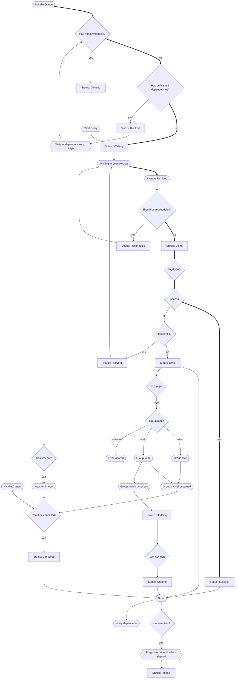

# wrk
A Go module for complex work/job systems with advanced controls

> go get github.com/clickermonkey/wrk

```mermaid
flowchart TD
        Queued(["Handle.Queue"])
        Cancel(["Handle.Cancel"])
        HasDelay{"Has remaining delay?"}
        WaitDelay{{"Wait Delay"}}
        HasDependencies{"Has unfinished dependencies?"}
        WaitDependencies{{"Wait for dependencies to finish"}}
        WaitingSystem{{"Waiting to be picked up"}}
        HasTimeout{"Has timeout?"}
        HasRetention{"Has retention?"}
        Timeout{{"Wait for timeout"}}
        CanCancel{"Can it be cancelled?"}
        HasRetries{"Has retries?"}
        ShouldReschedule{"Should be rescheduled?"}
        Purging{{"Purge after retention has elapsed"}}
        InGroup{"In group?"}
        GroupMode{"Group mode"}
        GroupStop(["Group stop"])
        GroupUndo(["Group undo"])
        GroupCancelUnstarted(["Group cancel unstarted"])
        GroupUndoSuccessful(["Group undo successes"])
        GroupContinue(["Error ignored"])
        Do{"Work.Do()"}
        Undo{"Work.Undo()"}
        DoStatus{"Success?"}
        SystemRun(["System.Run loop"])
        NotifyDependents(["Notify dependents"])
        FinalState(["Done"])
        Reschedule["Status: Reschedule"]
        Delayed["Status: Delayed"]
        Waiting["Status: Waiting"]
        Blocked["Status: Blocked"]
        Cancelled["Status: Cancelled"]
        Doing["Status: Doing"]
        Success["Status: Success"]
        Error["Status: Error"]
        Retrying["Status: Retrying"]
        Purged["Status: Purged"]
        Undoing["Status: Undoing"]
        Undone["Status: Undone"]
        
        Queued ==> HasDelay
        Queued --> HasTimeout
        Cancel --> CanCancel
        HasTimeout-- yes -->Timeout
        Timeout --> CanCancel
        CanCancel-- yes -->Cancelled
        HasDelay== no ==>HasDependencies
        HasDelay-- yes -->Delayed
        Delayed --> WaitDelay
        WaitDelay --> Waiting
        HasDependencies== no ==> Waiting
        HasDependencies-- yes --> Blocked
        Blocked --> WaitDependencies
        WaitDependencies --> HasDelay
        Waiting ==> WaitingSystem
        WaitingSystem ==> SystemRun
        SystemRun ==> ShouldReschedule
        ShouldReschedule== no ==>Doing
        ShouldReschedule-- yes -->Reschedule
        Reschedule-->WaitingSystem
        Doing ==> Do
        Do ==> DoStatus
        DoStatus== yes ==>Success
        DoStatus-- no -->HasRetries
        HasRetries-- no -->Error
        HasRetries-- yes -->Retrying
        Retrying-->WaitingSystem
        Success-->FinalState
        FinalState-->HasRetention
        Error-->FinalState
        Cancelled-->FinalState
        HasRetention-- yes -->Purging
        Purging-->Purged
        FinalState-->NotifyDependents
        Error-->InGroup
        InGroup-- yes -->GroupMode
        GroupMode-- stop -->GroupStop
        GroupMode-- undo -->GroupUndo
        GroupMode-- continue -->GroupContinue
        GroupStop-->GroupCancelUnstarted
        GroupUndo-->GroupCancelUnstarted
        GroupUndo-->GroupUndoSuccessful
        GroupCancelUnstarted-->CanCancel
        GroupUndoSuccessful-->Undoing
        Undoing-->Undo
        Undo-->Undone
        Undone-->FinalState
```
